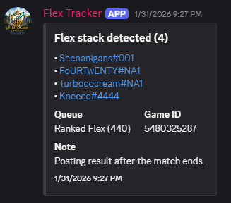
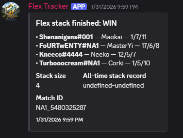
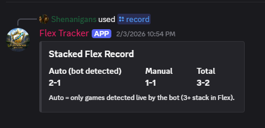
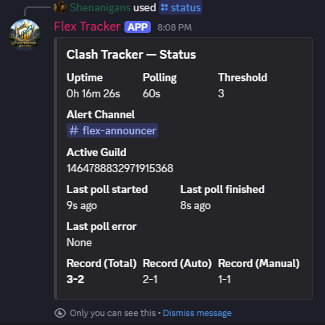
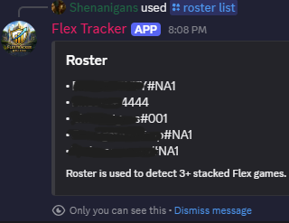
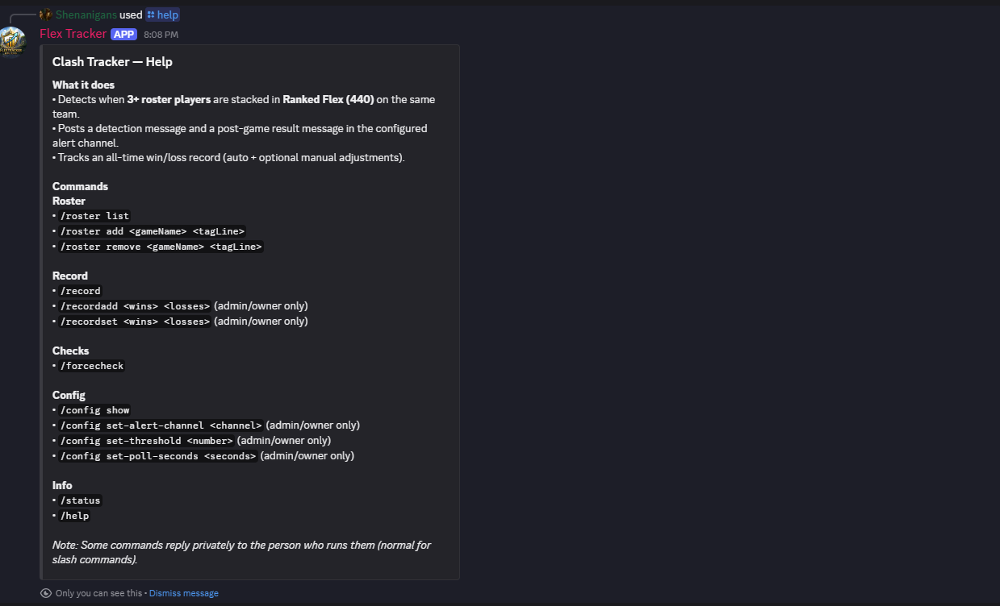

# Flex Tracker Discord Bot  
*Ranked Flex stack detection & match tracking*

Flex Tracker is a **self-hosted Discord bot** that monitors a roster of League of Legends players and posts alerts when **3 or more roster members queue Ranked Flex together on the same team (queue ID 440)**.  
It also tracks **team win/loss records** and supports **manual adjustments** for games played while the bot was offline.

The bot is designed for **small private Discord servers** and conservative Riot API usage.

---

## Version

Current release: **v1.2.2**

### What’s new in v1.2.2
- Expanded stats support (team-side + champion tracking groundwork for detailed stats commands).
- Fixed a startup crash caused by a SQLite migration/index mismatch (`no such column: champ`).
- Improved migrations to safely create/patch tables without breaking existing installs.

---

## Features

- Detects Ranked Flex (queue 440) games with **N+ roster players** on the same team  
  - Default threshold: **3**
- Automatically posts to a configurable Discord channel:
  - Stack detected (in-progress game)
  - Stack finished (WIN / LOSS)
- Match summaries include:
  - Champion played
  - K/D/A
  - Match ID
  - External profile links (OP.GG)
- Persistent SQLite storage:
  - **Auto record** – games detected by the bot
  - **Manual record** – admin adjustments
  - **Total record** – combined
- Full roster and configuration management via **Discord slash commands**
- No code edits required after setup

---

## Example Output & User Flow

Below are example screenshots showing how Flex Tracker is used in a Discord server.

### Stack detected (in-progress game)
When multiple roster members queue Ranked Flex together, the bot detects the stack.


### Match result summary
After the match finishes, the bot posts a summary with the result and player stats.


### Team record command
Displays the current stacked Flex win/loss record.


### Bot status command
Shows bot health, polling status, and last check information.


### Roster management
Lists the currently configured roster of Riot IDs.


### Help command
Shows available commands and basic usage information.


---

## Requirements

- **Node.js 20+**
- **npm**
- A Discord application + bot token
- A Riot Games API key
- A Discord server where you have admin permissions

Flex Tracker is intentionally **self-hosted**. Each server owner runs their own instance.

---

## Getting Started

### 1. Clone the repository

```bash
git clone https://github.com/knubgod/flextrackerbot.git
cd flextrackerbot
```

### 2. Install dependencies

```bash
npm install
```

### 3. Create a `.env` file

In the project root, create a file named `.env`:

```env
DISCORD_TOKEN=your_discord_bot_token
RIOT_API_KEY=your_riot_api_key
OWNER_USER_ID=your_discord_user_id
```

⚠️ **Never commit your `.env` file.**  
It is intentionally ignored by Git.

---

### 4. (Optional) Local roster seeding

You may optionally create a local file named:

```
roster.local.json
```

Example:

```json
[
  { "gameName": "PlayerOne", "tagLine": "NA1" },
  { "gameName": "PlayerTwo", "tagLine": "NA1" }
]
```

Notes:
- This file is **not required**
- It is **not tracked by Git**
- It allows the bot to preload a roster on startup
- Rosters can always be managed later via Discord commands

---

### 5. Run the bot

```bash
node index.js
```

For production use, a process manager such as **PM2** is recommended:

```bash
pm2 start index.js --name flex-tracker
pm2 save
```

---

## Discord Setup

Invite the bot to your server with:
- `bot`
- `applications.commands`

Once invited, use slash commands to:
- Set the alert channel
- Add or remove roster members
- View records and bot status
- Adjust thresholds and polling behavior

After configuration, the bot will automatically:
- Detect Ranked Flex stacks
- Track active matches
- Post match results when games finish

---

## Responsible API Usage

Flex Tracker is designed with **Riot Games API policies and rate limits** in mind.

### APIs Used

Flex Tracker uses only the following Riot APIs:
- **Spectator API** – detect active Ranked Flex games
- **Match API** – retrieve completed match data
- **Account API** – resolve Riot IDs to PUUIDs

No other Riot APIs are accessed.

---

### Database & migrations
Flex Tracker stores data locally in `bot.db` (SQLite).  
On startup, the bot may run safe migrations to add new columns/tables needed for newer versions.
If you upgrade versions, **do not delete `bot.db`** unless you intentionally want to reset stats/records.

---

### Rate Limiting & Polling

- Default polling interval: **60 seconds**
- Polling frequency is configurable but intentionally conservative
- API requests are limited to configured roster members only
- The bot does **not** scan arbitrary players or public match histories
- Local caching is used to reduce unnecessary repeat requests

---

### Data Handling & Privacy

- No personal data is collected beyond publicly available match statistics
- All data is stored locally in a SQLite database owned by the server operator
- No data is transmitted to third parties
- No analytics, tracking, or monetization is performed

---

### Scope & Intended Use

Flex Tracker is intended for:
- Small friend groups
- Amateur Ranked Flex teams
- Private Discord servers

The bot **does not**:
- Provide coaching or gameplay advice
- Automate gameplay
- Perform matchmaking manipulation
- Support betting or gambling
- Scrape, resell, or aggregate Riot data

---

## Compliance Statement

Flex Tracker is a **non-commercial, community-built project** and is not affiliated with or endorsed by Riot Games.

League of Legends and Riot Games are trademarks or registered trademarks of Riot Games, Inc.  
All assets and trademarks belong to their respective owners.